# Ghost Cursor Architecture Status

This map describes the implemented GhostCursor vertical slice. Solid nodes are
built code paths; dashed nodes are future product scope.

```mermaid
flowchart LR
    User[Human user]
    Args[CLI: --target / --recipe / --goal / --seconds]
    Bar[Control bar\nStop / Pause / Ask / goal input]
    Planner[Bounded goal planner\nregistered intent IDs only]
    HintAI[Screen-aware local inference\nobserved approved IDs only]
    Eval[Three-lane model gate\nraw quality + final authority + read-only UIA]
    Packs[Strict application packs\nmanifest + trusted recipes]
    Recipe[Hand-authored Recipe\nreasoning/recipes/*.json]

    subgraph Perception[Perception]
        UIA[UIA tier 1\npywinauto + Win32 window filtering]
        Service[PerceptionService\nworker thread + COM apartment\nsingle observation slot]
        Focus[Focus sampling\nAutomationId transitions]
        Warm[HWND warm-up gate]
        Capture[Window capture + frame diff]
        OCR[Windows.Media.Ocr\ntext reassembly]
        Tier2[Tier 2 controller\n1s floor / 20 fruitless-read cap]
        Health[WorkerHealth\nrestart once, then fail]
    end

    subgraph Reasoning[Reasoning]
        Ground[Grounding ladder\nAutomationId -> exact -> UIA substring -> OCR fuzzy]
        Loop[GuidedTour state machine\nobserve -> decide -> hint -> wait -> verify]
        Verify[World-state verification\nappearance / disappearance / focus / property / title]
        Fresh[Staleness ladder\nFRESH -> DIMMED -> INFERRED -> HIDDEN]
        Renderer[OverlayRenderer\natomic hint provenance + one paint state]
    end

    subgraph Display[Display and safety]
        Overlay[Win32 layered overlay\nclick-through / topmost / DPI-aware]
        Paint[WM_PAINT GDI ring\ncyan / dimmed / amber]
        Safety[ESC polling + timeout + finally teardown\nnever moves cursor or sends input]
    end

    subgraph Memory[Local learning]
        Identity[Durable step_key + app identity/version]
        Store[(SQLite KB\nLOCALAPPDATA only)]
        Promote[Promotion\nconfirmed UIA AutomationId only]
    end

    subgraph Missing[Future product scope]
        VLM[VLM pointing tier 3]
        Package[Tauri or installer packaging]
        AIOS[Later AIOS phases\nOnboard / Support / Collaborate / Operate]
    end

    User --> Args
    User --> Bar
    Args --> Planner
    Bar --> Planner
    Planner --> Recipe
    Packs --> Recipe
    Recipe --> Loop
    Service --> UIA
    Service --> Focus
    Warm --> Service
    Capture --> Tier2
    OCR --> Tier2
    Tier2 --> Service
    Health --> Service
    Service --> Ground
    Service --> HintAI
    HintAI --> Ground
    Planner --> Eval
    HintAI --> Eval
    Ground --> Loop
    Loop --> Verify
    Verify --> Loop
    Loop --> Fresh
    Loop --> Renderer
    Fresh --> Renderer
    Renderer --> Overlay
    Overlay --> Paint
    Safety --> Overlay
    Ground --> Promote
    Promote --> Identity
    Identity --> Store
    Store --> Recipe
    Ground -. last-resort visual tier .-> VLM
    Packs -. future distribution .-> Package
    Package -. later product .-> AIOS

    classDef done fill:#d9f2e6,stroke:#16734a,color:#123b2a;
    classDef partial fill:#fff0c2,stroke:#9a6b00,color:#4a3500;
    classDef missing fill:#f5dddd,stroke:#a33a3a,color:#521b1b,stroke-dasharray: 6 4;
    class User,Args,Bar,Planner,HintAI,Eval,Packs,Recipe,UIA,Service,Focus,Warm,Capture,OCR,Tier2,Health,Ground,Loop,Verify,Fresh,Renderer,Overlay,Paint,Safety,Identity,Store,Promote done;
    class VLM,Package,AIOS missing;
```

## What Is Done

### Working vertical slice

- Windows-first entry point in `ghostcursor/run.py`.
- Static mode can find a target window/control and draw a hint.
- Recipe mode runs a multi-step `GuidedTour` through the explicit
  observe/decide/render/wait/verify state machine.
- Verification is based on resulting UI state, not whether the user followed
  the suggested route. Wrong-action feedback uses sampled focus AutomationIds
  and re-hints the current step.
- The control bar exists as a separate focusable window so the full-screen
  overlay remains click-through. It supports Stop, Pause, Ask, status text, and
  a goal-input panel. Ask consumes goals through the same trusted planner used
  by `--goal`; active tours cannot be silently replaced. The first goal hint
  can additionally pass the live UI element list through the bounded inference
  layer, which may select only an observed recipe-approved AutomationId.

### Perception and grounding

- Tier 1 UI Automation reads visible, on-screen elements and normalizes them to
  one DPI-aware coordinate space.
- UIA runs on a dedicated worker with COM apartment ownership, a non-blocking
  overwritten observation slot, timestamps, and dead/stalled-worker recovery.
- Tier 2 uses DPI-correct per-window capture, frame differencing, Windows OCR,
  wrapped-label reassembly, conservative fuzzy matching, warm-up patience for
  cold Chromium windows, and bounded cadence/cost.
- Grounding has four rungs: confirmed AutomationId, exact name/type, UIA-only
  substring, and OCR fuzzy text. OCR-derived targets carry provenance and are
  rendered as inferred rather than confirmed.

### Overlay, safety, and learning

- The overlay is layered, topmost, transparent, non-activating, and painted
  only through `WM_PAINT`.
- Fresh, dimmed, inferred, and hidden display states are represented, with the
  hint coordinate and provenance bound together to prevent stale confidence.
- ESC polling, an automatic timeout, and `finally` teardown provide an escape
  path even when the target application is hung.
- Successful confirmed UIA grounding is promoted and persisted in a local
  SQLite knowledge base, scoped by step, app, version, and AutomationId.
- Later runs hydrate those observations; OCR data is explicitly excluded from
  persistence.
- Natural-language planning and screen-aware target selection are bounded by
  registered intent IDs, strict pack manifests, trusted recipe paths, and live
  observed AutomationIds.
- Registration bounds the model's vocabulary but does not grant semantic
  authority. Any model-selected intent with a recipe must agree with the
  deterministic classifier's grounded candidate; otherwise only a trusted
  fallback may run, or the goal is unsupported.
- Planner and hint inference share one bounded Ollama transport but keep
  separate dynamic schemas. A versioned 30-case gate measures raw advisory
  quality separately from final authority, reruns the production policy
  directly, and has an explicit read-only interactive lane against a
  provenance-tagged Synthetic Export UIA fixture. Its dataset cannot be
  promoted while owner review metadata is incomplete.
- The VS Code pack has two validated recipes. Open Folder uses a provider-side
  exact-name query plus title verification. Open Terminal uses a separate
  executable-bounded Button surface, a human `Ctrl+\`` instruction, and exact
  `Terminal Section` appearance verification. Already-present state completes
  before rendering; otherwise a first-hint deadline bounds the transition.
  Its empty Electron AutomationIds are never persisted.
- The logging-only foreground watcher matches installed packs without starting
  tours or displaying UI.

## What Remains

### Remaining implementation scope

1. Add more reviewed recipes to the existing trusted application-pack system.
2. Add a last-resort VLM pointing path only after
   UIA and OCR fail, preserving the existing provenance and inferred display
   safety rules.

### Productization and expansion

- Recipe authoring and validation UX for distributing additional packs.
- Pack versioning, refresh, licensing, and offline distribution decisions.
- Installer/packaging, likely the deferred Tauri or equivalent distribution
  layer.
- Broader AIOS phases: onboarding, support, collaboration, and operation. These
  are not part of the current Ghost Cursor implementation.

### Known follow-ups and risks

- Native UIA focus-change events are not built; focus feedback currently polls
  between worker walks, leaving a measured blind interval.
- The `ANY_MEANINGFUL_CHANGE` schema requires a `scope` value that verification
  does not currently use.
- Some real-desktop tests depend on the current Windows desktop and are not a
  clean CI contract; the fast suite count should not be treated as universal.
- Desktop controls without stable AutomationIds cannot participate in learned
  reuse or ID-based wrong-action naming; they remain eligible only for trusted
  live name/type grounding and deterministic world-state verification.

## Verification Snapshot

The repository contains focused tests for the overlay, end-to-end pixel path,
UIA, grounding, verification, state transitions, persistence, OCR, tier-2
cadence, freshness, warm-up, worker health, wrong-action feedback, and the
control bar. The slow hung-window tests must run alone on Windows. Run the
project's documented test commands sequentially; do not run two desktop/UIA
test sessions at the same time.

The real VS Code Open Folder and Open Terminal workflows each passed three
consecutive interactive desktop runs. The expanded Ask panel and submitted-goal
round trip also passed interactive validation. Repository-wide lane
classification is complete; the fresh-clone release gate remains.

The first complete model-durability draft passed every hard gate and measured
26/30 raw semantic intent decisions. All four raw over-commitments remained
non-launchable. This is diagnostic evidence, not yet the frozen incumbent
baseline, because owner review and two consecutive non-draft interactive passes
remain open.

# Open-track goal planning

Natural-language goals pass through `ghostcursor.reasoning.planner`. The model
may return only a registered intent ID; recipe paths, actions, coordinates,
and verification rules remain local trusted data. When Ollama is unavailable,
the planner uses deterministic phrase matching and reports the fallback
status. Unavailable registered intents fail honestly without a plan.
